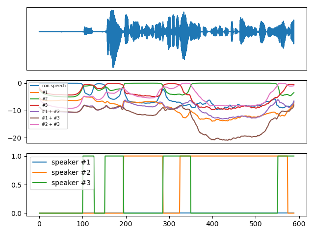

---
tags:
- pyannote
- pyannote-audio
- pyannote-audio-model
- audio
- voice
- speech
- speaker
- speaker-diarization
- speaker-change-detection
- speaker-segmentation
- voice-activity-detection
- overlapped-speech-detection
- resegmentation
license: mit
inference: false
extra_gated_prompt: "The collected information will help acquire a better knowledge of pyannote.audio userbase and help its maintainers improve it further. Though this model uses MIT license and will always remain open-source, we will occasionnally email you about premium models and paid services around pyannote."
extra_gated_fields:
  Company/university: text
  Website: text
---

Using this open-source model in production?  
Consider switching to [pyannoteAI](https://www.pyannote.ai) for better and faster options.

# 🎹 "Powerset" speaker segmentation

This model ingests 10 seconds of mono audio sampled at 16kHz and outputs speaker diarization as a (num_frames, num_classes) matrix where the 7 classes are _non-speech_, _speaker #1_, _speaker #2_, _speaker #3_, _speakers #1 and #2_, _speakers #1 and #3_, and _speakers #2 and #3_.



```python
# waveform (first row)
duration, sample_rate, num_channels = 10, 16000, 1
waveform = torch.randn(batch_size, num_channels, duration * sample_rate) 

# powerset multi-class encoding (second row)
powerset_encoding = model(waveform)

# multi-label encoding (third row)
from pyannote.audio.utils.powerset import Powerset
max_speakers_per_chunk, max_speakers_per_frame = 3, 2
to_multilabel = Powerset(
    max_speakers_per_chunk, 
    max_speakers_per_frame).to_multilabel
multilabel_encoding = to_multilabel(powerset_encoding)
```

The various concepts behind this model are described in details in this [paper](https://www.isca-speech.org/archive/interspeech_2023/plaquet23_interspeech.html).

It has been trained by Séverin Baroudi with [pyannote.audio](https://github.com/pyannote/pyannote-audio) `3.0.0` using the combination of the training sets of AISHELL, AliMeeting, AMI, AVA-AVD, DIHARD, Ego4D, MSDWild, REPERE, and VoxConverse.

This [companion repository](https://github.com/FrenchKrab/IS2023-powerset-diarization/) by [Alexis Plaquet](https://frenchkrab.github.io/) also provides instructions on how to train or finetune such a model on your own data.

## Requirements

1. Install [`pyannote.audio`](https://github.com/pyannote/pyannote-audio) `3.0` with `pip install pyannote.audio`
2. Accept [`pyannote/segmentation-3.0`](https://hf.co/pyannote/segmentation-3.0) user conditions
3. Create access token at [`hf.co/settings/tokens`](https://hf.co/settings/tokens).


## Usage

```python
# instantiate the model
from pyannote.audio import Model
model = Model.from_pretrained(
  "pyannote/segmentation-3.0", 
  use_auth_token="HUGGINGFACE_ACCESS_TOKEN_GOES_HERE")
```

### Speaker diarization

This model cannot be used to perform speaker diarization of full recordings on its own (it only processes 10s chunks). 

See [pyannote/speaker-diarization-3.0](https://hf.co/pyannote/speaker-diarization-3.0) pipeline that uses an additional speaker embedding model to perform full recording speaker diarization.

### Voice activity detection

```python
from pyannote.audio.pipelines import VoiceActivityDetection
pipeline = VoiceActivityDetection(segmentation=model)
HYPER_PARAMETERS = {
  # remove speech regions shorter than that many seconds.
  "min_duration_on": 0.0,
  # fill non-speech regions shorter than that many seconds.
  "min_duration_off": 0.0
}
pipeline.instantiate(HYPER_PARAMETERS)
vad = pipeline("audio.wav")
# `vad` is a pyannote.core.Annotation instance containing speech regions
```

### Overlapped speech detection

```python
from pyannote.audio.pipelines import OverlappedSpeechDetection
pipeline = OverlappedSpeechDetection(segmentation=model)
HYPER_PARAMETERS = {
  # remove overlapped speech regions shorter than that many seconds.
  "min_duration_on": 0.0,
  # fill non-overlapped speech regions shorter than that many seconds.
  "min_duration_off": 0.0
}
pipeline.instantiate(HYPER_PARAMETERS)
osd = pipeline("audio.wav")
# `osd` is a pyannote.core.Annotation instance containing overlapped speech regions
```

## Citations

```bibtex
@inproceedings{Plaquet23,
  author={Alexis Plaquet and Hervé Bredin},
  title={{Powerset multi-class cross entropy loss for neural speaker diarization}},
  year=2023,
  booktitle={Proc. INTERSPEECH 2023},
}
```

```bibtex
@inproceedings{Bredin23,
  author={Hervé Bredin},
  title={{pyannote.audio 2.1 speaker diarization pipeline: principle, benchmark, and recipe}},
  year=2023,
  booktitle={Proc. INTERSPEECH 2023},
}
```
